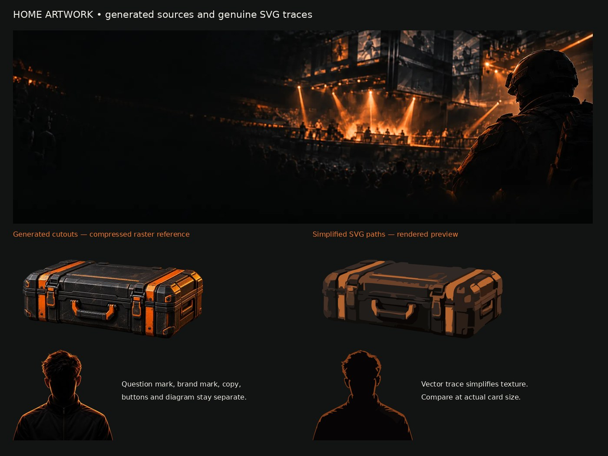

# Home mode artwork — #215

Generated with OpenAI image generation for Major Mayhem, prepared and traced by Codex on October 1, 2026. These original anonymous compositions use no official game renders, player photographs or team branding. The repository's ISC license applies; no third-party license or exclusivity guarantee is asserted.

The original full-resolution transparent PNGs are retained under `assets/sources/`, unchanged. `assets/case.svg` (74 paths) and `assets/pro-silhouette.svg` (6 paths) are simplified genuine color-path traces, with no embedded raster image. The production copies live in `src/assets/home/`; only those two assets are imported into the offline page. The question mark and existing interim Major Mayhem shield remain separate HTML/SVG layers. #112 owns the final brand identity.

This historical asset sheet also shows the arena prepared for #214. That arena is not included in this implementation; its source remains on the `design/home-mockup-followups` branch. The sheet is an asset comparison, not a screenshot of the implemented page. Actual production screenshots and validation are in [mode-cards](../mode-cards/README.md).

## Reproduction

Install Pillow 12.3.0 and vtracer 0.6.15, then run `python docs/design/2026-10-01-home-mockup/trace-assets.py`. The script reads the originals, downsizes to 480px, applies median denoising, 12-color quantization and alpha thresholding, then traces spline paths. Complete settings are in the script. Production copies must match the traced results.

The SVG generator comment reports the underlying visioncortex generator's version; the installed Python package used for tracing was vtracer 0.6.15. Raster comparison alternatives use a 640px maximum dimension and WebP quality 85, Pillow method 6.

Generation briefs: rugged black equipment case with orange edge rails, transparent backdrop and no logos; anonymous forward-facing esports competitor with shadowed face, black zip jacket and restrained orange hair/shoulder rim light, transparent backdrop and no question mark or branding. Separate image-generation calls used the supplied home mockup as a visual reference.

## Size and visual comparison

| Asset | Bytes | Gzip bytes |
| --- | ---: | ---: |
| case.svg | 99,517 | 34,770 |
| pro-silhouette.svg | 25,468 | 8,257 |
| case.webp | 43,856 | 43,889 |
| pro-silhouette.webp | 49,236 | 49,198 |

At production card size the trace keeps the case rails, handle and silhouette rim while dropping fine scratches, fabric and hair texture. The traces look more graphic than their raster sources; this is a deliberate simplification, not pixel equivalence. Their combined individual gzip size is about 43 KB versus 93 KB for the raster alternatives. The final single-file build is measured separately because data-URL encoding affects the result.
