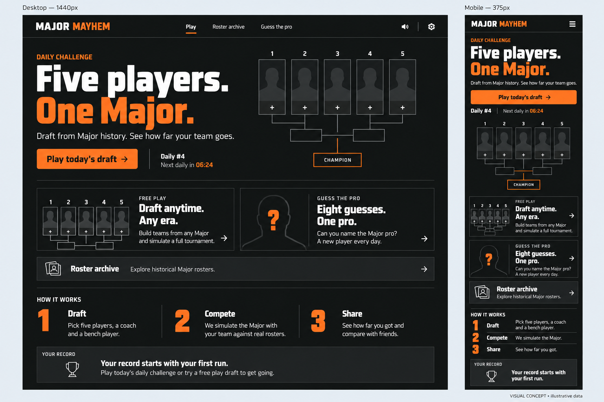
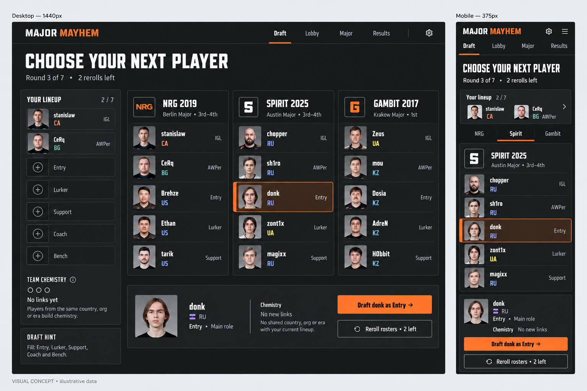
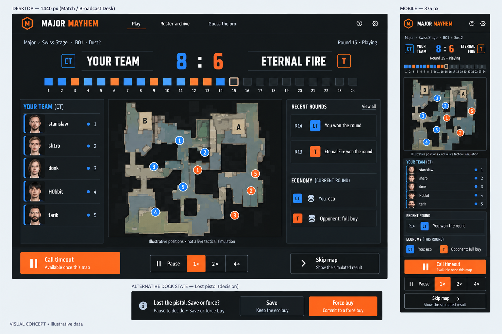
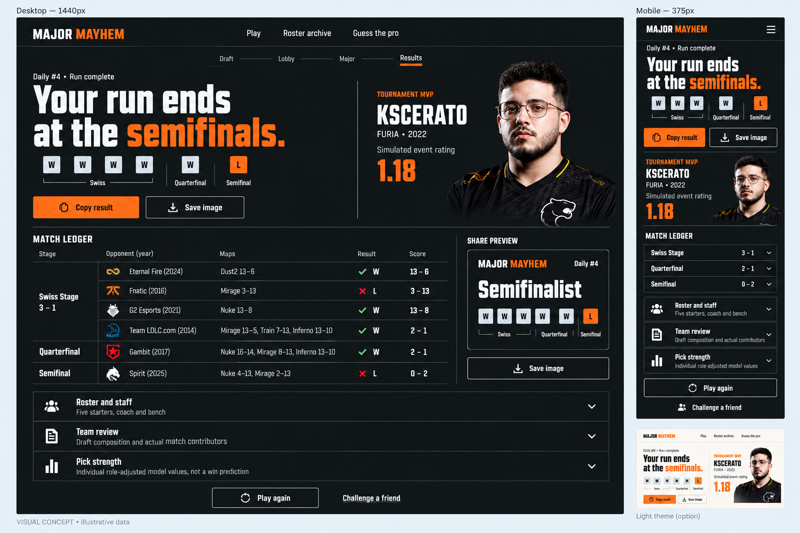

# Major Mayhem — visual concepts, 1 October 2026

Design-only proposals created at the user's request after reviewing the current home, draft, live match and results screens. No application code changes. Generated with OpenAI image generation and manually reviewed/refined. These references are not production assets or a replacement for the real roster/game data.

## Direction

Editorial esports: warm charcoal, chalk text, orange for decisions, larger player identification, short display headings, readable body type, fine rules and fewer enclosing panels. Reuse the current brand and provide equivalent light/high-contrast themes.

## Screens

### Home

### Draft

### Live

### Results

### Reference boundaries

These are AI-generated visual proposals, reviewed against the current UI, not executable layouts or production assets. Use existing credited portraits, logos, fonts and radar assets in implementation. Read roster dates, countries, roles and chemistry from the actual data. Some generated details remain inaccurate: the results timeline omits the Swiss loss shown in its ledger; the mobile radar repeats a marker and omits others; the draft example omits a shared-org chemistry link. The implementation must derive these from game state. Country codes must use neutral text, not arbitrary nationality colors or generated flags. Backgrounds/buttons should use flat fills despite residual shading in the images.

The board's “1440px/375px” labels describe target layouts, not measured viewport screenshots. Verify actual 320, 375, 768, 1440 and 1920px layouts, keyboard navigation, 200% zoom, dark/light/high contrast and reduced motion. Body text should be readable at normal scale; desktop controls need not all fit a phone's first viewport.

Keep seeded gameplay, save compatibility, hard-mode secrecy, existing share disclosure, pause/buy/timeout behavior, offline operation and absence of accounts. Progress steps remain informational, not links that undo a draft. No new runtime dependencies or network-loaded assets are needed for this visual pass.

## Implementation briefs

- [System brief](system-brief.md)
- [Home brief](home-brief.md)
- [Draft brief](draft-brief.md)
- [Live brief](live-brief.md)
- [Results brief](results-brief.md)
