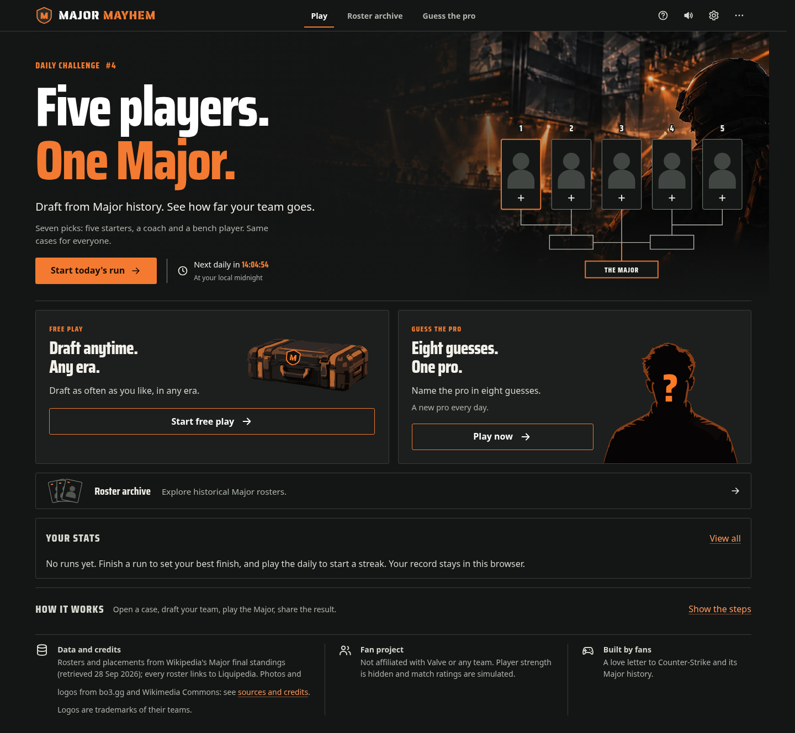
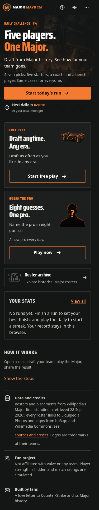
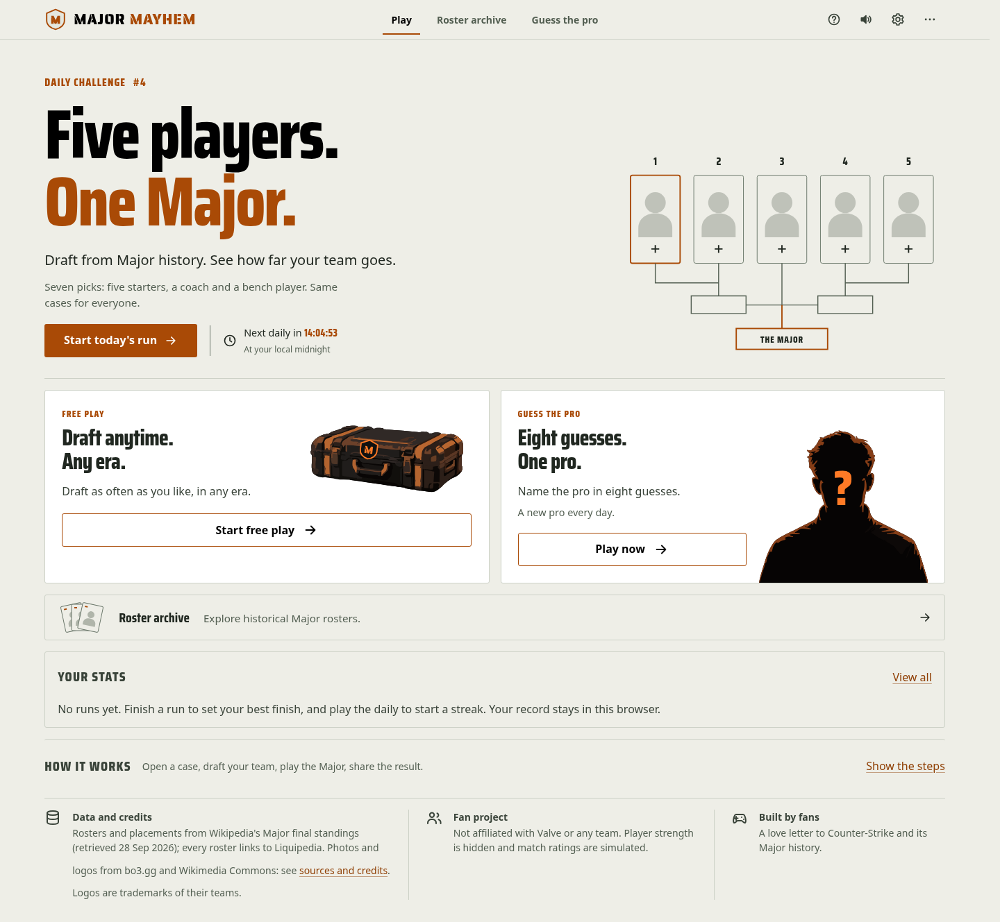

# Arena-backed Home hero — #214

Actual Chromium captures of the built offline site, with real HTML copy/actions and a separate SVG diagram. The arena is generated decoration; its pixels contain no interface or clickable player slots. Seven picks still explicitly mean five starters, a coach and a bench player.

Dark mode uses the arena behind both columns, with a quiet copy zone and lower-edge fade into the page. The first decorative starter card has an orange outline; diagram numbers have a dark text edge to remain readable over lighting. The daily action and clock are one cluster. Phones retain a subdued arena behind the copy and put the full-width action before decoration; the lineup is omitted. Light, high-contrast and forced-colors modes deliberately omit the arena and retain their palette contrast.

## Evidence

- Build and all 444 unit tests pass. Existing responsive UI checks pass at 320/375/768/1440/1920px, including active, completed, replay, abandoned and previous-day daily actions, with navigation preserving saved runs. The `home-state-*.png` captures show those cases.
- `scripts/hero-review.ts` captures desktop/phone in dark, light and both high-contrast palettes, checks five widths, keyboard focus, 44px daily targets, no page overflow at 200% root text scaling, forced colors, and artwork unavailable without changing a save.
- The browser clock crosses Stockholm local midnight from October 1 to October 2, updating Daily #4 to #5 without a reload (`midnight-rollover-375.png`). Countdown logic and its restrained screen-reader announcements are unchanged.
- The phone scrim has 88% opacity. Even assuming a white source pixel beneath the copy, the resulting maximum background produces contrast ratios of about 4.70:1 for the accent, 6.23:1 for muted copy and 11.32:1 for normal copy. Desktop protects the full left copy column with at least a 90% scrim. Existing theme/button contrast checks remain.
- Root text scaling is not manual 200% browser-zoom verification. Safari/Firefox and real touch devices remain unverified.

## Asset and offline size

`src/assets/home/arena.webp`: 1920×640, 48,694 bytes, WebP quality 80/method 6. Its unchanged generated 2172×724 PNG is retained in [the source pack](../2026-10-01-home-mockup/README.md), alongside generation provenance. The detailed arena remains raster; mode cutouts remain genuine SVG paths.

The background URL is declared once as a CSS variable so both desktop and phone treatments reuse a single inlined image. The encoded arena occurs exactly once in `dist/index.html`; there are no external artwork requests or runtime dependencies. Final build: 2,932.80 KB / 1,798.33 KB gzip, versus main's 2,866.46 KB / 1,747.30 KB gzip: **51.03 KB gzip increase**. Source PNGs and documentation screenshots are not bundled into the game.

#215's mode cards remain below the hero. #216's staged Free Play configuration is a separate follow-up.
