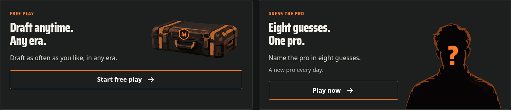
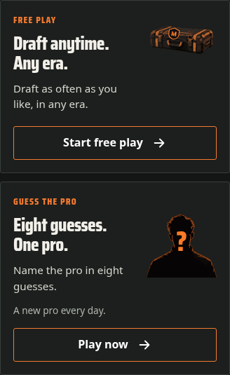

# Home mode cards — #215

The two Home cards now put their copy on the left and original generated, traced artwork on the right. Free Play uses an equipment case with the existing interim shield overlaid separately. Guess uses an anonymous silhouette with a separate question mark. Controls use visible labels: Play now, Keep guessing, or See today's answer. Free Play retains its current setup and confirmation flow; staged filters remain #216, and the arena hero remains #214.

## Production screenshots

These are Chromium captures of the built offline page, not concepts. The saved fixture is an unfinished daily with first-visit tips dismissed.

The remaining captures cover both high-contrast palettes at desktop/phone size and 200% root text scaling on a phone.

## Validation

- Build and all 444 unit tests pass. Existing full e2e and responsive UI suites cover saved games, navigation and five widths: 320, 375, 768, 1440 and 1920px.
- `scripts/mode-card-review.ts` checks fresh, in-progress, solved and failed Guess states in all four palettes at all five widths. Keyboard Enter navigates to Guess without altering an unfinished Major; cancelling a Free Play replacement preserves it. A new Free Play still reaches the real filters and Open case reaches the draft.
- Guess actions are visible HTML with targets at least 44px and keyboard focus. Decoration ignores pointers, adds no focus stops, and can be hidden without losing headings or actions. Forced-colors hides the art and keeps system-color button borders. Reduced-motion contexts preserve the static cards.
- 200% root text scaling reflows without page overflow. This is not a claim of manual 200% browser-zoom, real touch-device or Safari/Firefox verification.

## Assets and cost

[Sources, genuine trace previews and recipe](../2026-10-01-home-mockup/README.md) retain original generated PNGs and the WebP comparison alternatives. Production imports only the two traced SVGs, which match their source-pack copies. No raster wrapper, remote artwork, new runtime dependency, game rule or save-format change.

The final `dist/index.html` is 2,866.46 KB / 1,747.30 KB gzip; merged #219 was 2,696.55 KB / 1,699.74 KB gzip. The compressed offline cost is approximately 47.56 KB. Both SVGs are inlined in the self-contained page. The graphic trace drops small texture detail intentionally; side-by-side source/trace comparison is in the asset sheet and actual card-size output above.
